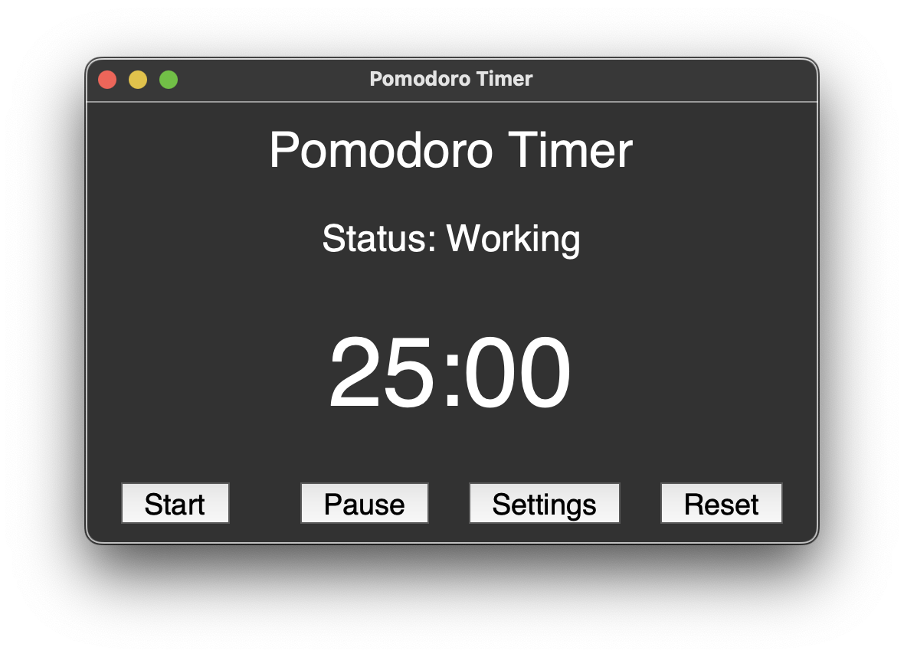

# Focus +

**Focus +** is a Pomodoro-based study system designed to boost your focus and maximize learning retention. Backed by the latest research in cognitive science and productivity, this tool helps you structure your study sessions for optimal performance.

## Features

- 🕒 Pomodoro Timer: Stay focused with customizable Pomodoro intervals.
- 📚 Science-Backed: Built on proven techniques to enhance memory retention.
- 🎯 Goal-Oriented Sessions: Track your progress and stay motivated.
- 🛠️ Lightweight & Easy to Use: Clean interface that gets out of your way.

## Why It Works

The Pomodoro Technique leverages focused work sprints followed by short breaks. This approach improves concentration and reduces mental fatigue. By integrating this with research-backed learning strategies, **Focus +** helps you study smarter, not harder.

## Getting Started

Clone the repo and install the requirements:

```bash
git clone https://github.com/yourusername/productivity-app.git
cd productivity-app
pip install -r requirements.txt
touch .env
```
Make sure to add a ChatGPT api key to the .env file under OPENAI_API_KEY

## Blocking Websites
### How to use the Website Blocking 

Select *Add Website*


Enter your website URL


### How to remove a Website

Highlight a website and then click on *Remove Website*


Website removed


# How to use Pomodoro


Click *Settings* and enter in desired work duration, short-break duration, and long-break duration. 


Finally, click *Start* to begin the timer

# Break Apps

### Doodling 
Doodling until your hearts content. Pressing *Enter* on the keyboard toggles constant drawing - no need to hold onto the mouse! Pressing *Space* enters Etch A Sketch mode allowing you to relieve your childhood. 


### Learn Prompt
Enter what you would like to be tested on, and the LLM will create test questions for your to answer!
:w
